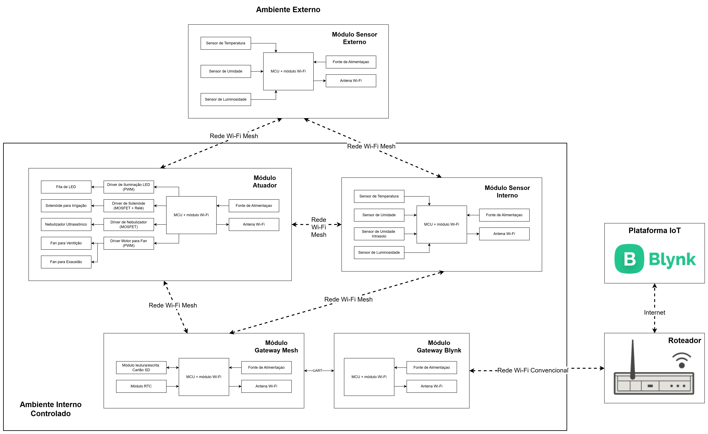
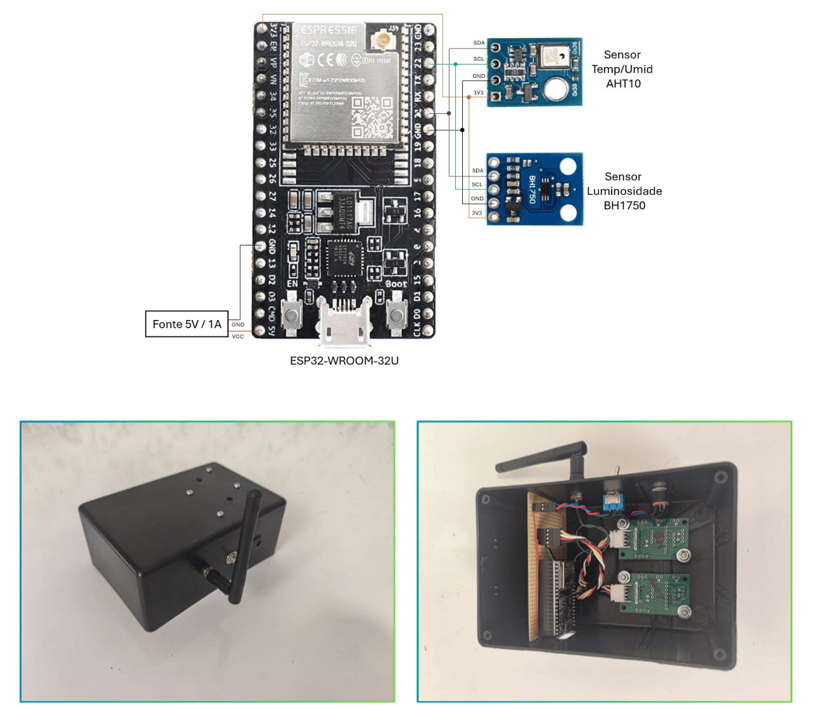
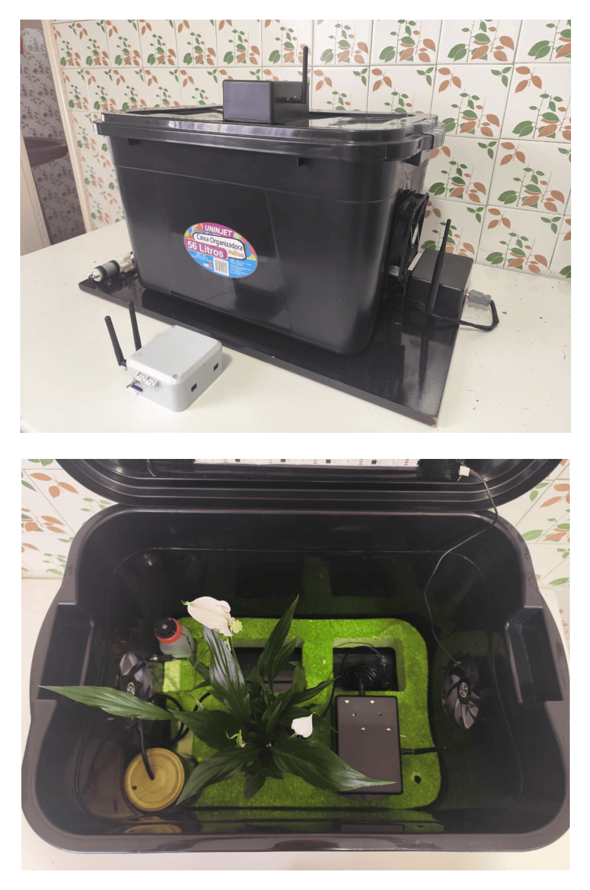
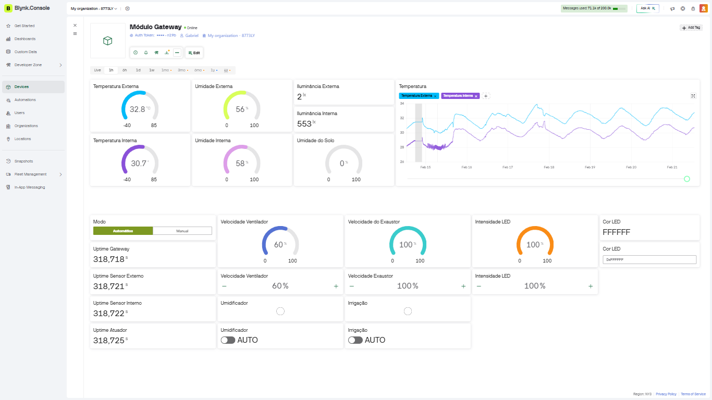

# Controle de Ambientação Inteligente - EmbarcaTech 2025 3° Fase

Autores: **Gabriel Mattano, Jorge Wilker e Roger Melo**
Curso: Residência Tecnológica em Sistemas Embarcados
Instituição: EmbarcaTech – HBr
Campinas, Outubro/2025 a Fevereiro/2026

---

## ✨ Visão geral

O projeto **Controle de Ambientação Inteligente** tem como objetivo desenvolver um sistema de automação capaz de monitorar e ajustar as condições de um ambiente — como iluminação, temperatura e umidade — de forma autônoma e eficiente. A solução integra sensores e atuadores em uma maquete física, permitindo simular o funcionamento de uma estufa ou cômodo inteligente. O sistema combina lógica de controle, interface de monitoramento remoto e atuação coordenada de dispositivos como ventiladores, nebulizadores e iluminação dimerizável, demonstrando aplicações práticas em automação residencial, agrícola e laboratorial.

O sistema monitora **temperatura**, **umidade**, **luminosidade** e **umidade do solo** — e aciona automaticamente **ventiladores**, **nebulizador**, **irrigação** e **iluminação** para manter condições-alvo.  
A operação pode ser **automática (AUTO)** ou **manual (MANUAL)**, com acompanhamento e comandos via aplicativo **Blynk**.

---

## 📸 Visão geral (fotos e diagramas)

### Diagrama do sistema


### Fotos dos módulos

**Gateway**  


**Sensor Externo**  


**Sensor Interno**  


**Atuador**  


**Estufa (montagem geral)**  


### Dashboard Blynk


---

## Arquitetura do sistema

### Visão lógica
- **Gateway**: 2× ESP32
  - `mesh_gateway_module`: forma a malha, recebe telemetria, envia comandos, executa controle automático e repassa dados ao Blynk via UART
  - `blynk_gateway_module`: conecta no Wi‑Fi/Blynk e converte Vpins em mensagens CFG para o gateway mesh via UART
- **Sensor Externo**: temperatura/umidade + luminosidade
- **Sensor Interno**: temperatura/umidade + luminosidade + umidade do solo
- **Atuador**: LED, fans, nebulizador e irrigação

### Diagrama textual
```
[App Blynk]
     │ Wi‑Fi
[blynk_gateway_module]  ←── UART (COBS+CRC16) ───→  [mesh_gateway_module]
                                                              │ Wi‑Fi Mesh
                                              ┌───────────────┼───────────────┐
                                    [ext_sensor_module] [int_sensor_module] [actuator_module]
                                      T/UR/Lux           T/UR/Lux/Solo       LED/Fan/Neb/Bomba
```

### Comunicação e protocolo
- Rede: `painlessMesh` (Wi‑Fi Mesh)
- Gateway↔Gateway: **UART** (encapsulamento **COBS** + **CRC16‑CCITT**)
- Tipos de mensagem: `HELLO`, `TELE`, `STATE`, `CFG`, `HB`, `ACK`, `TIME`
- **QoS1** para mensagens críticas (ex.: `CFG`, `HELLO`) com ACK e retry

---

## 📁 Estrutura do repositório

```
controle_ambientacao_inteligente/
├─ README.md
├─ LICENSE
├─ .gitignore
├─ doc/
│  ├─ README.md
│  ├─ relatorio_final.pdf           # entrega principal (opcional no repo)
│  ├─ img/                          # placeholders e evidências (fotos/prints)
│  └─ etapas/
│     └─ etapa_1/                   # histórico do desenvolvimento
└─ firmware/
   ├─ blynk_gateway_module/         # Wi‑Fi ↔ Blynk ↔ UART
   ├─ mesh_gateway_module/          # Nó raiz mesh + controller + RTC/SD
   ├─ mesh_ext_sensor_module/       # Sensor externo (T/UR/Lux)
   ├─ mesh_int_sensor_module/       # Sensor interno (T/UR/Lux/Solo)
   └─ mesh_actuator_module/         # Atuador (LED/Fans/Neb/Bomba)
```

### READMEs por módulo
- `firmware/blynk_gateway_module` → [README](firmware/blynk_gateway_module/README.md)
- `firmware/mesh_gateway_module` → [README](firmware/mesh_gateway_module/README.md)
- `firmware/mesh_ext_sensor_module` → [README](firmware/mesh_ext_sensor_module/README.md)
- `firmware/mesh_int_sensor_module` → [README](firmware/mesh_int_sensor_module/README.md)
- `firmware/mesh_actuator_module` → [README](firmware/mesh_actuator_module/README.md)

---

# ✅ Como reproduzir o projeto

## 1) Pré‑requisitos (software)
- **VS Code + PlatformIO** (recomendado) ou **PlatformIO Core (CLI)**
- Framework: **Arduino Core para ESP32** (via PlatformIO)
- Python instalado (se usar PlatformIO via terminal)

> Os projetos **não** utilizam Arduino IDE nem ESP‑IDF diretamente — cada pasta de módulo já possui `platformio.ini` com dependências.

## 2) Hardware necessário (lista de referência)

| Componente | Qtd | Observação |
|---|---:|---|
| ESP32‑WROOM‑32 (DevKit / esp32doit-devkit-v1) | 5 | Um por módulo, exceto modulo Gateway que utiliza 2 |
| Sensor AHT20 (temp/umidade) | 2 | I2C — sensores interno e externo |
| Sensor BH1750 (luminosidade) | 2 | I2C — sensores interno e externo |
| Sensor capacitivo umidade de solo | 1 | Analógico — sensor interno |
| RTC DS1307 + bateria CR2032 | 1 | I2C — no `mesh_gateway_module` |
| Módulo SD Card SPI | 1 | SPI — no `mesh_gateway_module` |
| Ventilador 12V 40mm PWM | 4 | 2 entrada + 2 saída (atuador) |
| Fita LED | 1 | Conforme protótipo (PWM/FastLED + driver) |
| Nebulizador ultrassônico | 1 | 5V (ou equivalente) |
| Solenóide / bomba de irrigação | 1 | 12V (ou equivalente) |
| Driver/MOSFET/Relé | conforme | Para cargas (não ligar direto no ESP32) |
| Fontes 5V / 12V | conforme | Conforme consumo do seu conjunto |

> Componentes equivalentes podem ser usados desde que respeitem tensão/corrente e interface (I2C/ADC/PWM).

## 3) Clone do repositório
```bash
git clone https://github.com/gabrielmattanosilva/controle_ambientacao_inteligente.git
cd controle_ambientacao_inteligente
```

## 4) Configurar credenciais (obrigatório)
Em **cada módulo** dentro de `firmware/*/include/`:

1) Copie `credentials.example.h` → `credentials.h`  
2) Edite o `credentials.h`

### 4.1) Mesh (todos os módulos mesh)
```c
#define MESH_PREFIX     "ambientacao_mesh"
#define MESH_PASSWORD   "12345678"
#define MESH_PORT       5555
```

### 4.2) Wi‑Fi/Blynk (somente `blynk_gateway_module`)
```c
#define BLYNK_TEMPLATE_ID   "SEU_TEMPLATE_ID"
#define BLYNK_TEMPLATE_NAME "Controle de Ambientação Inteligente"
#define BLYNK_AUTH_TOKEN    "SEU_AUTH_TOKEN"
#define WIFI_SSID           "SEU_WIFI"
#define WIFI_PASSWORD       "SUA_SENHA_WIFI"
```

> ⚠️ `credentials.h` não deve ser versionado (o `.gitignore` ignora `**/include/credentials.h`).

## 5) Compilar, gravar e monitorar (PlatformIO)

Dentro de cada pasta de módulo:
```bash
# Compilar
pio run

# Compilar e gravar (com o ESP32 conectado via USB)
pio run --target upload

# Monitorar saída serial
pio device monitor --baud 115200
```

## 6) Ordem de gravação/inicialização recomendada
1. `firmware/mesh_gateway_module` (nó raiz da Mesh)
2. `firmware/blynk_gateway_module` (Blynk↔UART)
3. Sensores/atuador (qualquer ordem):
   - `firmware/mesh_ext_sensor_module`
   - `firmware/mesh_int_sensor_module`
   - `firmware/mesh_actuator_module`

## 7) Ligações essenciais (mínimo para reproduzir)

### 7.1) UART entre gateways (obrigatório)
Conectar cruzado + GND comum:

- `blynk_gateway_module` **TX (GPIO17)** → `mesh_gateway_module` **RX (GPIO26)**  
- `blynk_gateway_module` **RX (GPIO16)** ← `mesh_gateway_module` **TX (GPIO27)**  
- **GND ↔ GND**

### 7.2) I2C (sensores e RTC)
- **SDA: GPIO21**
- **SCL: GPIO22**

### 7.3) Sensor de solo (interno)
- **ADC: GPIO34**

### 7.4) Atuadores (referência)
Os pinos exatos variam com o seu protótipo. Use como referência e confira em `firmware/mesh_actuator_module/include/pins.h`.

> ⚠️ Não ligue cargas direto no ESP32: use drivers/MOSFET/relés e fonte adequada.

---

## 8) Configurar o Blynk (datastreams)

### Telemetria
- V0: t_out
- V1: rh_out
- V2: lux_out
- V3: t_in
- V4: rh_in
- V5: soil_moist
- V6: lux_in

### Estado dos atuadores (feedback)
- V7: intake_pwm
- V8: exhaust_pwm
- V9: humidifier
- V10: led_brig
- V11: led_rgb
- V12: irrigation

### Controle
- V13: modo (0=AUTO, 1=MANUAL)
- V14: intake_pwm (manual)
- V15: exhaust_pwm (manual)
- V16: humidifier (manual)
- V17: led_pwm (manual)
- V18: led_rgb (manual, string `RRGGBB`)
- V19: irrigation (manual)

### Heartbeats (diagnóstico)
- V20: mesh_gateway_module
- V21: mesh_ext_sensor_module
- V22: mesh_int_sensor_module
- V23: mesh_actuator_module

---

## 9) Teste operacional (sanidade)
1. Energize o Gateway e confirme no Serial:
   - Wi‑Fi conectado no `blynk_gateway_module`
   - Mesh formada no `mesh_gateway_module`
2. Energize os sensores e confirme telemetria no Blynk (V0..V6).
3. Energize o atuador e confirme estado (V7..V12) e heartbeat (V23).
4. Teste **MANUAL**:
   - coloque **V13=1** e acione V14..V19
5. Teste **AUTO**:
   - coloque **V13=0** e observe a atuação baseada nas leituras

---

## 🧯 Troubleshooting (rápido)
- **Sem telemetria no Blynk:** confira `credentials.h` no `blynk_gateway_module` e se o app tem os datastreams corretos.
- **Nós não entram na mesh:** `MESH_PREFIX/MESH_PASSWORD/MESH_PORT` devem ser iguais em todos os módulos mesh.
- **UART não funciona:** confira cruzamento TX/RX e GND comum.
- **I2C falhando:** confira SDA/SCL e alimentação dos sensores/RTC.

---

## Licença
Distribuído sob **GNU GPL‑3.0**. Veja [LICENSE](LICENSE).
