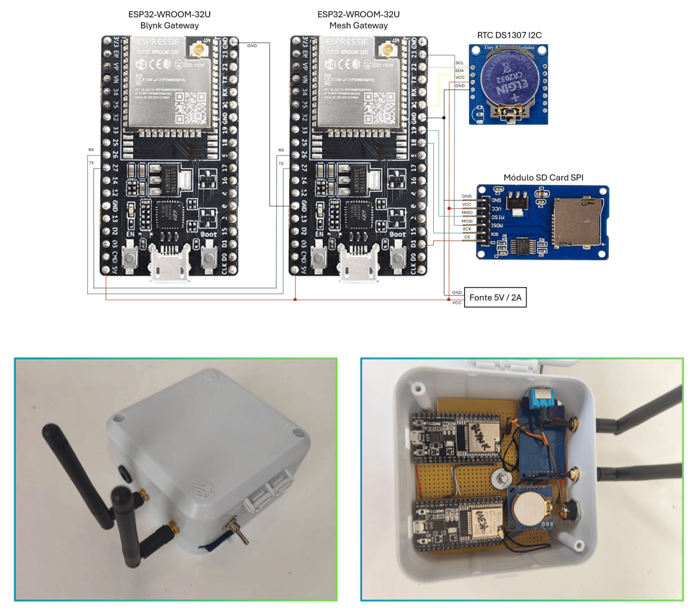

# blynk_gateway_module

ESP32 responsável por:
- Conectar no **Wi‑Fi**
- Conectar no **Blynk**
- Receber comandos do app (Vpins) e enviar como mensagens **CFG** para o `mesh_gateway_module` via **UART**
- Receber telemetria/estado/heartbeat vindos do `mesh_gateway_module` e publicar no Blynk (V0..V23)

---

## 📸 Foto do módulo


---

## ✅ Como compilar / gravar (PlatformIO)
Abra esta pasta no VS Code (PlatformIO) e rode **Upload**.

CLI:
```bash
pio run -e esp32doit-devkit-v1 -t upload
pio device monitor -b 115200
```

---

## 🔐 Configuração (credenciais)
Crie `include/credentials.h` copiando o exemplo:

- `include/credentials.example.h` → `include/credentials.h`

Campos esperados:
- `BLYNK_TEMPLATE_ID`
- `BLYNK_TEMPLATE_NAME`
- `BLYNK_AUTH_TOKEN`
- `WIFI_SSID`
- `WIFI_PASSWORD`

> ⚠️ `credentials.h` não deve ser versionado.

---

## 🔌 Pinos (hardware)
Definidos em `include/pins.h`:

- UART_TX_PIN: **GPIO17**
- UART_RX_PIN: **GPIO16**

### UART para o mesh_gateway_module (conexão cruzada)
- TX (GPIO17) → RX do mesh gateway (**GPIO26**)
- RX (GPIO16) ← TX do mesh gateway (**GPIO27**)
- GND ↔ GND

---

## 📲 Blynk (Vpins)
O firmware assume o mapeamento abaixo.

### Telemetria
- V0: t_out
- V1: rh_out
- V2: lux_out
- V3: t_in
- V4: rh_in
- V5: soil_moist
- V6: lux_in

### Estado dos atuadores
- V7: intake_pwm
- V8: exhaust_pwm
- V9: humidifier
- V10: led_brig
- V11: led_rgb
- V12: irrigation

### Controle
- V13: modo (0=AUTO, 1=MANUAL)
- V14..V19: controles manuais

### Heartbeats
- V20..V23

> Veja o README da raiz para a lista completa.

---

## 🧪 Teste rápido (sanidade)
1. Suba o firmware e abra o serial monitor.
2. Confira conexão Wi‑Fi e Blynk.
3. No app, altere **V13** e confirme que o firmware imprime o modo.
4. No modo manual, altere V14..V19 e confira se o JSON CFG é enviado via UART.

---

## 🧯 Troubleshooting
- Se não conecta no Wi‑Fi/Blynk: revise `include/credentials.h`
- Se não chega telemetria no app: confira se o mesh gateway está enviando mensagens UART
- Se UART não funciona: confira cruzamento TX/RX e GND comum
