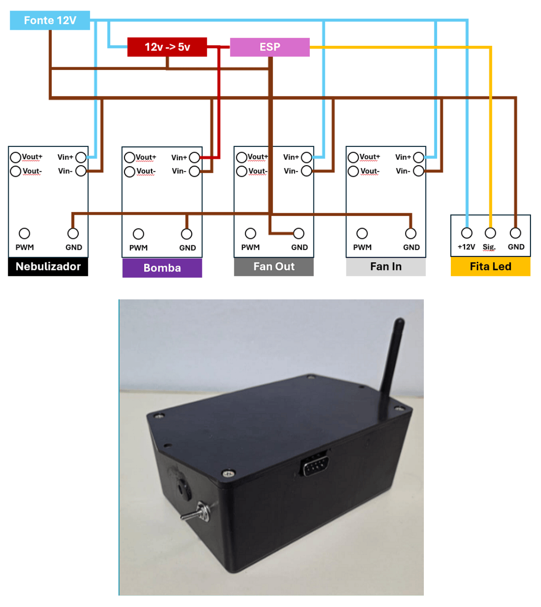

# mesh_actuator_module

Nó de atuadores (malha) responsável por:
- Fans (entrada e exaustão) via PWM
- Nebulizador
- Irrigação (bomba/solenóide)
- LEDs (FastLED)

Recebe comandos CFG via malha e publica estado (STATE) + heartbeat (HB).

---

## 📸 Foto do módulo (placeholder)


---

## ✅ Como compilar / gravar (PlatformIO)

```bash
pio run -e esp32doit-devkit-v1 -t upload
pio device monitor -b 115200
```

---

## 🔐 Configuração (mesh)
Crie `include/credentials.h` copiando o exemplo:

- `include/credentials.example.h` → `include/credentials.h`

Campos esperados:
- `MESH_PREFIX`
- `MESH_PASSWORD`
- `MESH_PORT`

---

## 🔌 Pinos (hardware)
Definidos em `include/pins.h`:

- FAN_INTERNO_PIN: **GPIO25**
- FAN_EXTERNO_PIN: **GPIO27**
- NEBULIZADOR_PIN: **GPIO26**
- BOMBA_PIN: **GPIO33**
- LED_DATA_PIN: **GPIO14**

> ⚠️ Em projetos reais, não ligue cargas direto no ESP32: use **drivers/MOSFET/relés** e fonte adequada.  
> Garanta **GND comum** entre ESP32 e drivers.

---

## ⏱️ Periodicidade
- HB (heartbeat): **a cada 1 minuto** (`HB_PERIOD_MS`)

---

## 🧪 Teste rápido (com Blynk)
1. Coloque o sistema em modo manual (**V13=1**).
2. Aja nos Vpins V14..V19.
3. Confirme no Blynk o feedback de estado:
   - V7..V12 (STATE)
   - V23 (HB)

---

## 🧯 Troubleshooting
- Atuadores não respondem: confirme que o nó entrou na mesh e que está recebendo CFG
- LED não acende: confira `LED_DATA_PIN`, tipo de fita e alimentação 5V
- Fans não giram: confirme PWM/driver e fonte da carga
