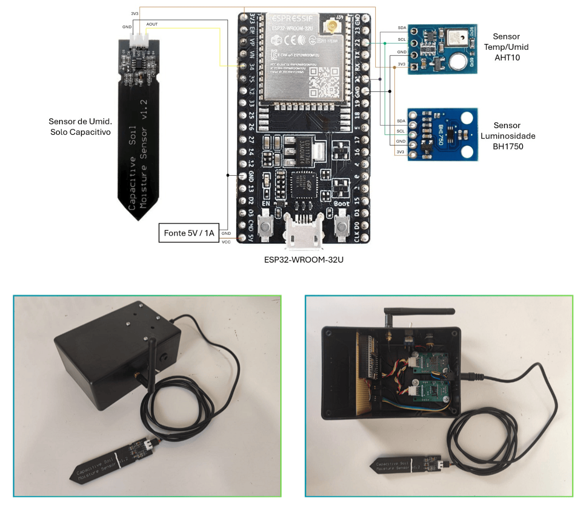

# mesh_int_sensor_module

Nó de sensores internos (malha):
- Temperatura/Umidade: **AHT10/AHT20**
- Luminosidade: **BH1750 (I2C)**
- Umidade do solo: **sensor capacitivo (ADC)**

Publica telemetria para o `mesh_gateway_module`.

---

## 📸 Foto do módulo (placeholder)


---

## ✅ Como compilar / gravar (PlatformIO)

```bash
pio run -e esp32doit-devkit-v1 -t upload
pio device monitor -b 115200
```

---

## 🔐 Configuração (mesh)
Crie `include/credentials.h` copiando o exemplo:

- `include/credentials.example.h` → `include/credentials.h`

Campos esperados:
- `MESH_PREFIX`
- `MESH_PASSWORD`
- `MESH_PORT`

---

## 🔌 Pinos / wiring
Definidos em `include/pins.h`:

### I2C
- SDA: **GPIO21**
- SCL: **GPIO22**

### Umidade do solo (ADC)
- SOIL_MOISTURE_SENSOR: **GPIO34**

---

## ⏱️ Periodicidade
- TELE: **a cada 5 minutos**
- HB (heartbeat): **a cada 1 minuto**

(ajustável via `TELE_PERIOD_MS` e `HB_PERIOD_MS` no código)

---

## 🧪 Teste rápido
1. Grave e abra o serial monitor.
2. Confirme inicialização dos sensores (AHT/BH1750).
3. Verifique leituras de solo (ADC) variando ao molhar/secar.
4. No Blynk, confirme atualização de V3..V6 e heartbeat V22.

---

## 🧯 Troubleshooting
- Leitura de solo “travada”: confira se o pino ADC está correto e se o sensor é compatível 3.3V
- Sensor I2C não detectado: confira SDA/SCL e endereços
